# tetris_score_server

スコアアタック用サーバ for https://github.com/seigot/tetris  
フロントエンド開発リポジトリ  https://github.com/TetrisChallenge/tetris_score_server_frontend


# 使い方

## 専用webサイトからプログラム提出
- 大会エントリー情報を入力してください→[大会エントリーフォーム入力ページ](https://tetris-server.challenge-club.org/#/entry)  
- 開発したテトリスプログラムをサーバ上で評価できます→[スコア評価フォーム入力ページ](https://tetris-server.challenge-club.org/#/server)

## APIを使ったプログラム提出
- [protocol buffers](https://developers.google.com/protocol-buffers)をテンプレートとして用いたプログラム提出用のAPIを開発しております。coming soon...

# システム構成




# サーバスペック
サーバ上ではスコア評価ジョブをECS Fargate上のコンテナで行っています。
[Fargateタスクサイズに関するAWSドキュメント](https://docs.aws.amazon.com/ja_jp/AmazonECS/latest/developerguide/AWS_Fargate.html#fargate-tasks-size)

以下はECSのタスク定義です。また、[terraformのリソース定義ファイル](./cloud/terraform/resouces/ecs.tf)でも確認することができます。
```
1 vCPU, 2GB
```

# 開発環境構築
[こちら](./README_server.md)を参照してください。

# APIを用いたプログラム提出方法（開発中）
### --protocol bufffersの導入とAPI提出のテンプレート生成--
[protobuf CLIのインストール](https://github.com/protocolbuffers/protobuf#protocol-compiler-installation)を行ったのち、  
[.protoファイル](protobuf/score_evaluation_message.proto)をダウンロードしてそれぞれの開発言語に沿ったコンパイルファイルを作成してご利用ください。[参考ドキュメント](https://developers.google.com/protocol-buffers/docs/tutorials)  
コンパイルの例↓  
```
protoc --python_out=[コンパイルファイルの出力先] [.protoファイルの格納フォルダ]/score_evaluation_message.proto
```
