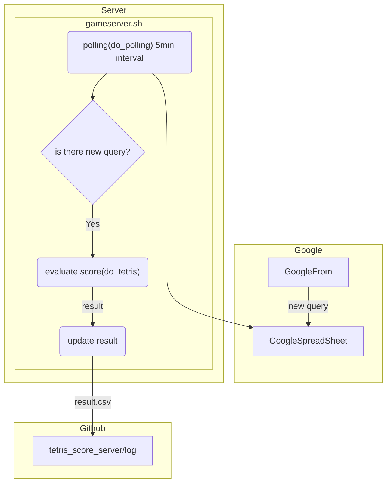

# tetris_score_server

スコアアタック用サーバ for https://github.com/seigot/tetris  
~~総当たり戦用サーバへの登録も兼ねています https://github.com/seigot/tetris_battle_server~~ 廃止

# 使い方

### 以下にリポジトリ URL を入力して下さい

新サーバをご参照 --> [https://d3tf7pdepo037t.cloudfront.net/#/](https://d3tf7pdepo037t.cloudfront.net/#/)  
~~2022/3_Tetris スコアアタック用サーバ（Google フォームを使用しています~~

### 評価結果は以下に出力されます

新サーバをご参照 --> [https://d3tf7pdepo037t.cloudfront.net/#/](https://d3tf7pdepo037t.cloudfront.net/#/)  
~~[評価結果一覧](./log/result.csv)~~
~~[level1 の評価結果](./log/result_ranking_level_1.csv)~~
~~[level2 の評価結果](./log/result_ranking_level_2.csv)~~
~~[level3 の評価結果](./log/result_ranking_level_3.csv)~~

※数十分ほど掛かることがあります

# システム構成



# サーバ稼働期間

2022/1/1-2022/9/30 とする予定

# サーバスペック

`2 cpu`, `2GB memory(swap 4GB)`, `40GB virtual storage`

```
$ grep cpu.cores /proc/cpuinfo | sort -u
cpu cores	: 2
$ free -h
              total        used        free      shared  buff/cache   available
Mem:          1.9Gi       363Mi       103Mi       3.0Mi       1.5Gi       1.4Gi
Swap:         4.0Gi        23Mi       4.0Gi
$ df -h | grep /dev/vda1
/dev/vda1        39G   12G   27G  31% /
```
