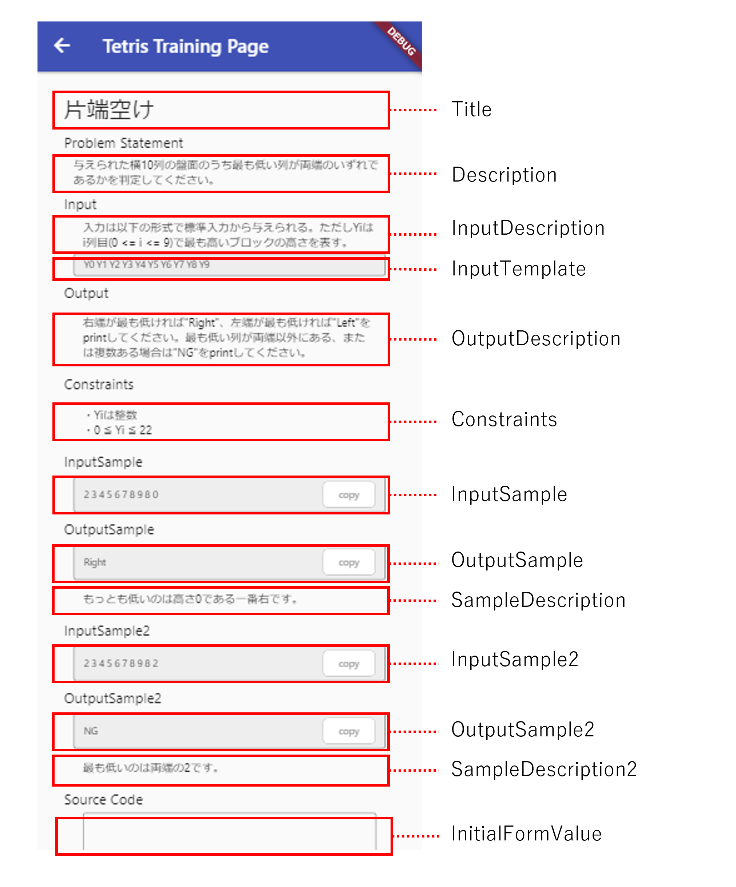

# Trainingモード問題作成
このドキュメントはトレーニングモードの問題作成用です。  
https://tetris-server.challenge-club.org/trainings


## 前提
現在サポートしている問題形式は二つです。
1. Atcoderっぽい形式  
標準入力を受け取り、期待される解答を文字列として標準出力させるプログラムを提出形式  
2. テトリスっぽい形式  
https://gituhb.com/seigot/tetris に準拠し、問題文に応じてBlock_Controllerクラスを作成して提出する方式

## 問題作成
一つの問題は以下の要素から構成されています。これらを準備することで問題を作成することができます。

## 問題文  
問題文は以下の要素から構成されています。  
二つの形式で問題文を構成する要素は共通です。

以下はテンプレートのCSVです
```
Title,Description,InputDescription,InputSample,InputTemplate,OutputDescription,OutputSample

```

## テストケース
いずれの形式でもテストケースはinputとoutputを記載したファイルから構成されています。  
1.Atcoderっぽい形式  
input.txt  
改行区切りで記載。1行が1ケース  
```
1
2
3
```
output.txt  
```txt:output.txt
2
4
6
```  

2.テトリスっぽい形式  
input.json  
json形式の配列として記載。配列の一要素が1ケース  
block_list: 落とすブロックのインデックス配列  
initial_board: 与える初期盤面。長さ220の数列 
```json:input.json
[
    {
        "block_list":[1],
        "initial_board":[
            0, 0, 0, 0, 0, 0, 0, 0, 0, 0,
            0, 0, 0, 0, 0, 0, 0, 0, 0, 0,
            0, 0, 0, 0, 0, 0, 0, 0, 0, 0,
            0, 0, 0, 0, 0, 0, 0, 0, 0, 0,
            0, 0, 0, 0, 0, 0, 0, 0, 0, 0,
            0, 0, 0, 0, 0, 0, 0, 0, 0, 0,
            0, 0, 0, 0, 0, 0, 0, 0, 0, 0,
            0, 0, 0, 0, 0, 0, 0, 0, 0, 0,
            0, 0, 0, 0, 0, 0, 0, 0, 0, 0,
            0, 0, 0, 0, 0, 0, 0, 0, 0, 0,
            0, 0, 0, 0, 0, 0, 0, 0, 0, 0,
            0, 0, 0, 0, 0, 0, 0, 0, 0, 0,
            0, 0, 0, 0, 0, 0, 0, 0, 0, 0,
            0, 0, 0, 0, 0, 0, 0, 0, 0, 0,
            0, 0, 0, 0, 0, 0, 0, 0, 0, 0,
            0, 0, 0, 0, 0, 0, 0, 0, 0, 0,
            0, 0, 0, 0, 0, 0, 0, 0, 0, 0,
            0, 0, 0, 0, 0, 0, 0, 0, 0, 0,
            0, 0, 0, 0, 0, 0, 0, 0, 0, 0,
            0, 0, 0, 0, 0, 0, 0, 0, 0, 0,
            0, 0, 0, 0, 0, 0, 0, 0, 0, 0,
            0, 0, 0, 0, 0, 0, 0, 0, 0, 0
        ]
    }
]
```
output.json  
output: 期待する出力
```json:output.json
[
    {
        "output":[
            0, 0, 0, 0, 0, 0, 0, 0, 0, 0,
            0, 0, 0, 0, 0, 0, 0, 0, 0, 0,
            0, 0, 0, 0, 0, 0, 0, 0, 0, 0,
            0, 0, 0, 0, 0, 0, 0, 0, 0, 0,
            0, 0, 0, 0, 0, 0, 0, 0, 0, 0,
            0, 0, 0, 0, 0, 0, 0, 0, 0, 0,
            0, 0, 0, 0, 0, 0, 0, 0, 0, 0,
            0, 0, 0, 0, 0, 0, 0, 0, 0, 0,
            0, 0, 0, 0, 0, 0, 0, 0, 0, 0,
            0, 0, 0, 0, 0, 0, 0, 0, 0, 0,
            0, 0, 0, 0, 0, 0, 0, 0, 0, 0,
            0, 0, 0, 0, 0, 0, 0, 0, 0, 0,
            0, 0, 0, 0, 0, 0, 0, 0, 0, 0,
            0, 0, 0, 0, 0, 0, 0, 0, 0, 0,
            0, 0, 0, 0, 0, 0, 0, 0, 0, 0,
            0, 0, 0, 0, 0, 0, 0, 0, 0, 0,
            0, 0, 0, 0, 0, 0, 0, 0, 0, 0,
            0, 0, 0, 0, 0, 0, 0, 0, 0, 0,
            1, 0, 0, 0, 0, 0, 0, 0, 0, 0,
            1, 0, 0, 0, 0, 0, 0, 0, 0, 0,
            1, 0, 0, 0, 0, 0, 0, 0, 0, 0,
            1, 0, 0, 0, 0, 0, 0, 0, 0, 0
        ]
    }
]
```